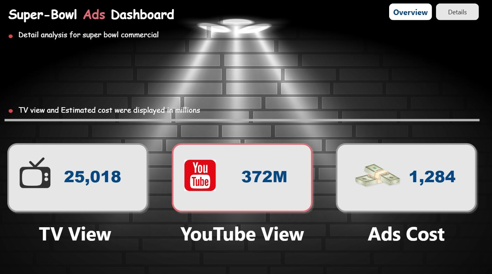
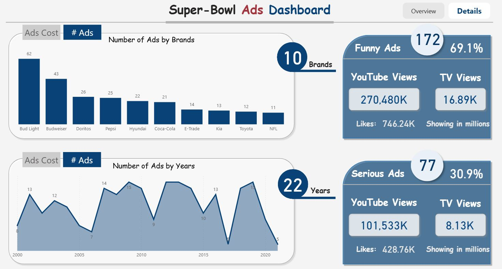
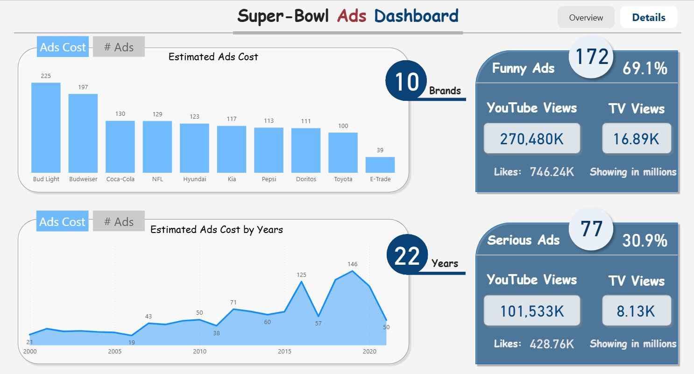

# Super Bowl Ads Dashboard (Power BI)

## Introduction
This dashboard is designed for **marketing analysts, advertisers, and media strategists** who need a unified view of **Super Bowl commercial performance** across brands and years.  
The core problem it solves is that **costs, TV reach, YouTube engagement, and creative style (funny vs serious)** are usually scattered across sources—making it hard to compare effectiveness or spot trends quickly.  
With this report, stakeholders can answer questions like:
- Which **brands** invested the most, and how did their ads perform?
- How did **ad volumes and costs** evolve over time (2000–2022)?
- Do **funny ads** outperform **serious ads** on YouTube views and likes?
- What’s the balance between **traditional TV views** and **online engagement**?

The dataset used in this analysis comes from a **Super Bowl ads dataset** (inspired by the YouTube tutorial [Power BI Super Bowl Ads Dashboard](https://www.youtube.com/watch?v=MIhVG4OqMk8&list=PLwIcJx1aSL1SeTJgPbFgf1V-5CfsV4l1l&index=5)), containing details such as **brand**, **year**, **ad style** (funny/serious), **TV views**, **YouTube views & likes**, and **estimated ad costs**.

---

## Dashboard File
- **Interactive report:** [Open in Power BI Service](https://app.powerbi.com/view?r=eyJrIjoiZDcwZWU0YjQtZDNlZi00NDU2LWIwZTAtYTFiMTA5YjIwYzRmIiwidCI6ImRmODY3OWNkLWE4MGUtNDVkOC05OWFjLWM4M2VkN2ZmOTVhMCJ9)

---

## Tools & Skills Demonstrated
This project highlights both technical and analytical skills for media-performance analysis:

- 🎨 **Dashboard Design:** Clean, two-page layout with spotlight theme; clear separation of overview vs detailed analysis.  
- ⚙️ **Power Query (ETL):** Type enforcement, shaping, and cleaning.  
- 🔗 **Data Modeling:** Engineered a **star schema starting from a single fact table**; created **DimBrand** and **DimYear**, plus a dedicated **Measure Table** to support brand/year breakdowns and reusable KPIs.  
- 🧮 **DAX Measures** (examples):  
  - `# Ads`, `# Funny Ads`, `# Serious Ads`, `% Funny Ads`, `% Serious Ads`  
  - `# TV Views`, `# YouTube Views`, `# YouTube Likes`  
  - `Ads Costs` (total/by brand/by year), `# Brands`, `# Years`, `Total Records`  
- 🧭 **Interactivity:** **Bookmarks + Buttons** to toggle analytical views (e.g., **Ad Counts** ↔ **Ad Costs**).  
- 📊 **Visuals:** KPI cards, column & area charts, segmented KPI panels (Funny vs Serious), brand and year summaries.

---

## Dashboard Overview

The report has **two pages**, intentionally designed to guide stakeholders from a fast executive read to focused analysis and actions—without overwhelming them with raw numbers.

---

### Page 1 — **Overview (Scope & Channel Mix)**

**Purpose**  
Provide a clean executive snapshot of the Super Bowl ads landscape—what the campaign scope looks like and how attention is split between traditional TV and online platforms.

**This page helps answer**  
- What is the overall picture of Super Bowl advertising at a glance?  
- How is attention distributed between broadcast TV and digital/YouTube?  
- Where should a strategist start before drilling into brands, years, or creative style?

**Key visuals & layout**  
- Compact KPI tiles for quick scanning (scope and channel mix)  
- A clear, distraction-free layout to set context for deeper analysis  
- Navigation entry point to the detailed view

**Interactions**  
- Simple page navigation (no slicers here) to preserve a consistent, comparable read

---

### Page 2 — **Details (Brands • Timeline • Creative Style)**

**Purpose**  
Enable targeted exploration across **brands**, the **timeline**, and **creative style**—with a single click switching between **volume** and **cost** perspectives.

**This page helps answer**  
- Which brands lead the conversation—by activity and by investment?  
- How have ad strategies evolved across years (peaks, dips, shifts)?  
- Do **funny** vs **serious** creatives behave differently across TV vs YouTube engagement?

**Key visuals & layout**  
- **Brand leaderboard** to compare presence and spend  
- **Timeline trend** to observe patterns across years  
- **Creative style panel** (funny vs serious) to compare engagement profiles at a glance

**Interactions**  
- **Bookmark-based buttons** to toggle between **“Ad Counts”** and **“Ad Costs”** views  
- Consistent labeling and aligned panels to support quick cross-reading (brand → year → creative style)

---

## Conclusion
This dashboard provides a clear, two-step decision path for marketing teams: a fast executive read of campaign scope and channel mix, followed by focused analysis across brands, timeline, and creative style.  
By separating **Overview** from **Details** and enabling one-click toggles between **volume** and **cost** views, it helps stakeholders align quickly, compare like-for-like perspectives, and move from context to action without cognitive overload.