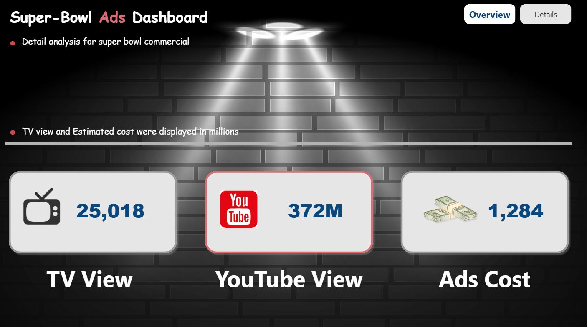
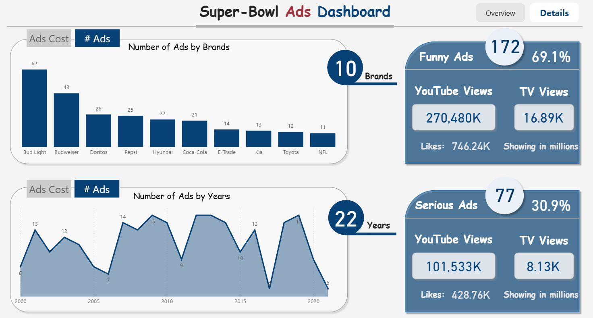
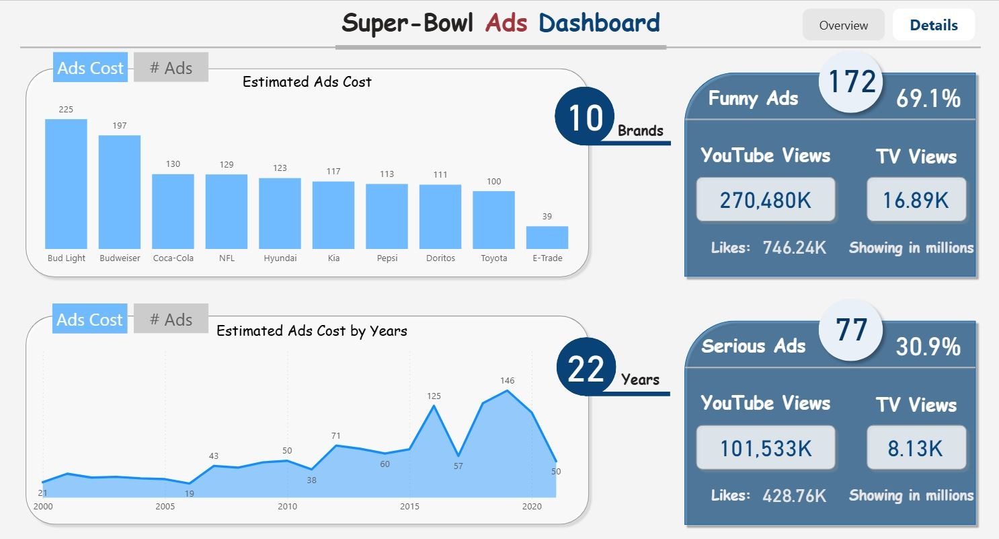

# Super Bowl Advertising Strategy & Brand Benchmarking Analysis

This Power BI case study explores how major brands approached Super Bowl advertising from **2000 to 2021**, with a focus on **brand investment, creative strategy, and digital engagement**.

The analysis covers **249 commercials from 10 brands across 22 years**, using estimated media cost, ad characteristics, TV audience context, and YouTube engagement data to compare patterns across brands and creative styles.

### Interactive Dashboard

[Open the report in Power BI Service](https://app.powerbi.com/view?r=eyJrIjoiZDcwZWU0YjQtZDNlZi00NDU2LWIwZTAtYTFiMTA5YjIwYzRmIiwidCI6ImRmODY3OWNkLWE4MGUtNDVkOC05OWFjLWM4M2VkN2ZmOTVhMCJ9)

---

## Business Question

**How did major brands approach Super Bowl advertising investment, and which creative characteristics are associated with stronger digital engagement?**

The analysis focuses on four questions:

- Which brands were most active and invested the most in Super Bowl advertising?
- How did estimated advertising cost change over time?
- How do creative characteristics such as humor and celebrity presence relate to typical YouTube engagement?
- How strongly do individual high-performing ads influence brand-level totals?

---

## Dataset & Scope

The dataset contains one row per commercial and includes brand, year, ad length, estimated cost, creative attributes, TV audience context, YouTube views, YouTube likes, and links to the original advertisements.

| Metric | Scope |
|---|---:|
| Commercials | 249 |
| Brands | 10 |
| Years | 22 |
| Analysis period | 2000–2021 |
| Estimated media cost | $1,284.1M |
| Funny ads | 172 (69.1%) |
| Celebrity ads | 71 (28.5%) |

Creative attributes in the dataset include:

- Funny
- Celebrity
- Patriotic
- Animals
- Danger
- Product shown quickly
- Sexual content

---

## Analytical Approach

The project combines descriptive brand benchmarking with engagement analysis.

Key analytical choices include:

- comparing brands by both **number of commercials** and **estimated media cost**
- using **median YouTube views per ad** instead of totals when comparing creative groups, reducing the influence of extreme outliers
- using **median like rate** (`YouTube Likes / YouTube Views`) to compare typical engagement intensity
- treating missing YouTube engagement as missing data rather than zero engagement
- using TV audience as **year-level context** rather than summing the repeated audience value across advertisements
- examining high-view commercials separately to understand how individual outliers affect brand-level totals

---

## Key Findings

### 1. Bud Light and Budweiser had the largest advertising presence

**Bud Light** appears most frequently in the dataset with **62 commercials** and approximately **$224.96M** in estimated media cost.

**Budweiser** follows with **43 commercials** and approximately **$196.90M** in estimated media cost.

This shows that both brands maintained a sustained Super Bowl presence across the period rather than relying on isolated campaigns.

---

### 2. Estimated Super Bowl advertising cost increased substantially over time

Normalizing estimated media cost to a **30-second equivalent**, the typical cost increased from approximately **$2.1M in 2000** to about **$5.5M in 2021**.

This is roughly a **2.6× increase** over the period covered by the dataset.

Because ad lengths vary, the normalized 30-second comparison is more meaningful than comparing raw total annual spend alone.

---

### 3. Funny ads were more common, but engagement results were mixed

Funny commercials represent approximately **69.1%** of all ads in the dataset.

Typical YouTube view counts were somewhat higher for funny ads:

- **Funny:** median ≈ **49.8K views**
- **Serious:** median ≈ **39.5K views**

However, serious ads showed stronger typical like engagement:

- **Funny:** median like rate ≈ **0.28%**
- **Serious:** median like rate ≈ **0.40%**

The data therefore does not support a simple conclusion that one creative tone consistently performs better across all engagement measures.

---

### 4. Celebrity presence was associated with stronger like engagement, not higher typical views

Celebrity ads had lower typical YouTube view counts in this dataset:

- **Celebrity:** median ≈ **41.3K views**
- **Non-celebrity:** median ≈ **53.4K views**

But celebrity ads had a higher median like rate:

- **Celebrity:** ≈ **0.47%**
- **Non-celebrity:** ≈ **0.28%**

This suggests that celebrity presence is associated with stronger typical like engagement in the available data, but not with higher typical reach.

---

### 5. Doritos' YouTube performance is heavily influenced by one major outlier

Doritos accounts for approximately **60.6% of all YouTube views** in the dataset.

However, one **2012 Doritos commercial** alone generated approximately **181.4M views**, representing about **48.8% of all YouTube views in the dataset**.

This makes total brand-level views potentially misleading unless the outlier is explicitly considered.

The result is a useful example of why median-based comparisons and outlier checks are important when evaluating digital campaign performance.

---

## Dashboard

The Power BI report contains two pages that move from a high-level overview to more detailed brand, timeline, and creative analysis.

### Overview

The overview summarizes the scale of the dataset and provides high-level context for advertising cost, audience, and digital engagement.

### Detailed Analysis

The detailed view supports comparison across brands and years and uses interactive buttons/bookmarks to switch between advertising volume and cost perspectives.

---

## Technical Implementation

**Power BI**
- two-page interactive report
- KPI cards, brand comparisons, timeline analysis, and creative-style breakdowns
- bookmarks and buttons for switching analytical views

**Power Query**
- data type validation
- data shaping and preparation

**Data Modeling**
- star-schema structure built from the source table
- separate Brand and Year dimensions
- dedicated measure table for reusable KPIs

**DAX**
- ad counts and brand/year metrics
- estimated advertising cost measures
- funny vs serious comparisons
- percentage measures
- engagement metrics and ranking logic

---

## Data Quality Notes

The dataset contains several limitations that affect interpretation:

- **12 commercials** have no YouTube view data.
- **18 commercials** have no YouTube like data; 6 of those still have view counts.
- One 2014 record contains a non-integer YouTube-like value and should be treated cautiously in like-based analysis.
- TV audience is repeated across advertisements within each year, so it should not be summed across rows.
- One 2014 TV-audience value is inconsistent with other advertisements from the same year, making robust year-level statistics preferable to row-level totals.

These checks are important because treating missing values as zero or aggregating repeated audience values would distort the analysis.

---

## Limitations

This is a portfolio case study and should not be interpreted as a complete analysis of the full Super Bowl advertising market.

- The dataset covers **10 selected brands**, not every advertiser.
- Estimated media cost is not the same as verified campaign expenditure.
- YouTube views and likes are influenced by upload timing, platform history, and availability and should not be treated as a controlled measure of advertising effectiveness.
- Creative attributes are binary classifications and do not capture all aspects of creative quality.
- The dataset contains no sales, conversion, or campaign-revenue data, so **ROI cannot be calculated**.
- Associations between creative characteristics and engagement do not establish causality.

---

## Tools & Skills

**Power BI · DAX · Power Query · Data Modeling · Data Validation · Marketing Analytics · Brand Benchmarking · Digital Engagement Analysis · Data Visualization**

---

## Data Source & Attribution

The starting dataset and dashboard concept were inspired by the YouTube tutorial **Power BI Super Bowl Ads Dashboard**:

[Original Tutorial](https://www.youtube.com/watch?v=MIhVG4OqMk8&list=PLwIcJx1aSL1SeTJgPbFgf1V-5CfsV4l1l&index=5)

The dataset also contains links to individual commercials on Super Bowl Ads and YouTube.

The business framing, data-quality review, analytical interpretation, key findings, and portfolio documentation presented here were developed as part of this independent analytics case study.
