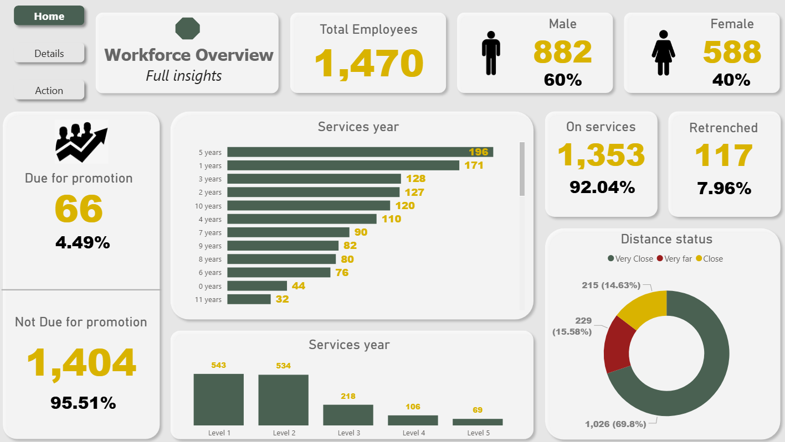
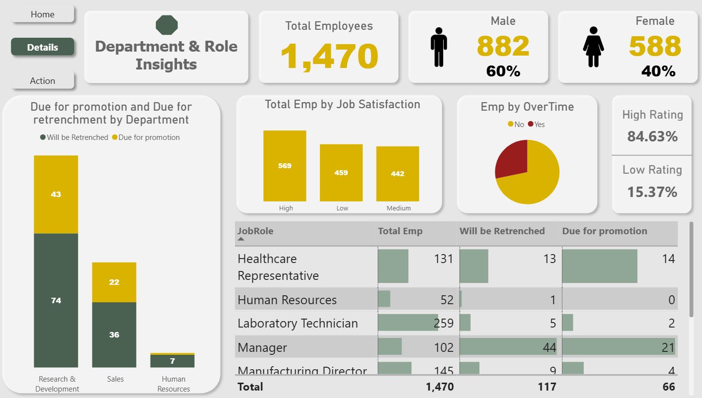
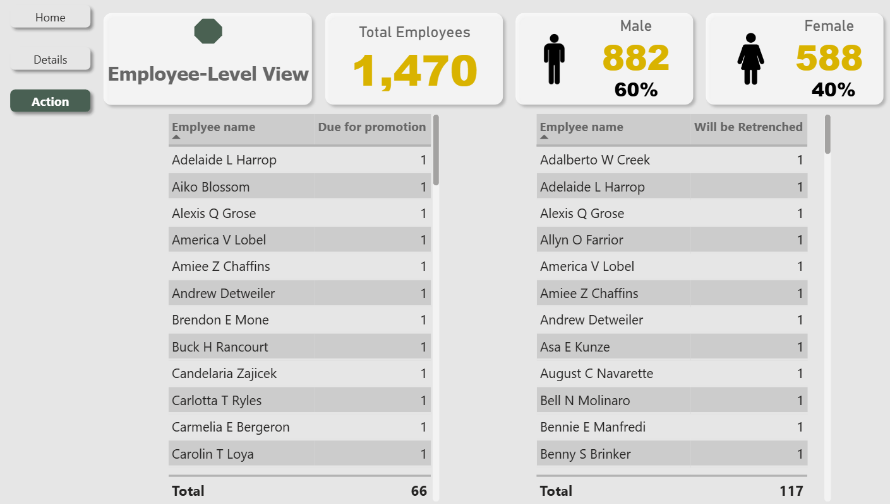

# HR Analytics Dashboard (Power BI)

## Introduction
This HR Analytics Dashboard is designed for **HR managers and business leaders** who need a clear, data-driven view of their workforce.  

The main challenge they face is that information about employees—such as promotions, retrenchments, satisfaction levels, and demographics—is often scattered across different systems, making it difficult to identify risks and opportunities quickly.  

This dashboard brings all those insights into one interactive platform, helping HR professionals answer critical questions like:  
- Which employees are due for promotion, and in which departments?  
- Where are retrenchment risks the highest?  
- How is the workforce distributed by gender, service years, and job roles?  
- Which employees require immediate action?  

The dataset used in this analysis comes from an **HR employee dataset** (inspired by the YouTube tutorial [Power BI HR Dashboard](https://www.youtube.com/watch?v=0BKlUySopU4&list=PLwIcJx1aSL1SeTJgPbFgf1V-5CfsV4l1l)), containing details such as demographics, job roles, years of service, job satisfaction, and promotion/retention status.

---
## Dashboard File
You can find the file for the dashboard here: [HR_Dashboard.pbix](https://app.powerbi.com/view?r=eyJrIjoiMDFiYzk4NTQtMmE2OC00NDQ2LWI5NjEtY2I2MTFiMzI2OGE5IiwidCI6ImRmODY3OWNkLWE4MGUtNDVkOC05OWFjLWM4M2VkN2ZmOTVhMCJ9)  

---

## Tools & Skills Demonstrated
This project highlights both the technical and analytical skills applied in building an HR-focused dashboard and put key Power BI features into practice. Here's what was mastered:

🎨 **Dashboard Design:** Crafted an intuitive and visually appealing multi-page layout tailored for HR insights.  

⚙️ **Power Query (ETL):** Performed data cleaning, shaping, and transformation to prepare the employee dataset for analysis.  

🔗 **Data Modeling:** Built an efficient data model following star schema principles to support department-level and employee-level analysis.  

🧮 **DAX Fundamentals:** Created calculations and aggregations to derive HR-specific KPIs, such as:  
- % Due for Promotion  
- % On Service vs % Retrenched  
- Employee Rating Distribution (High vs Low)  
- Department-wise Promotion & Retrenchment Counts  

📊 **Visualizations Utilized:**  
- 📈 Core Charts: Column, Bar, and Donut charts for comparisons and trends  
- 🔢 Cards: Highlighted key performance indicators at a glance  
- 📋 Tables: Provided detailed, employee-level information  
- 🎨 Chart Variety: Combined common and less common visuals for effective storytelling  
- 🔘 Buttons: Enabled streamlined navigation between pages  
---

## Dashboard Overview

The report is organized into three pages, each with a distinct focus to guide HR managers from a high-level view toward actionable insights.

---

### **Page 1: Home – Workforce Overview**
### Page 1: Home – Workforce Overview

This page serves as the **executive summary** of the organization’s workforce.  
It provides a snapshot of the most important KPIs, enabling HR leaders to quickly understand the overall state of employees:  

- **Key KPIs:** Total Employees (1,470), Gender Split (60% Male, 40% Female), % Due for Promotion (4.49%), % Retrenched (7.96%).  
- **Demographics:** Distribution by Years of Service.  
- **Mobility:** Distance-from-work segmentation (Very Close, Close, Very Far).  

👉 This page answers the question: *“What is the overall structure and current state of our workforce?”*

---

### **Page 2: Details – Department & Role Insights**

The second page allows a **deeper breakdown** of the workforce by department and role.  
It highlights variations in promotion readiness, retrenchment, and employee sentiment across different segments:  

- **Promotions & Retrenchments:** Department-level breakdowns.  
- **Satisfaction Levels:** High, Medium, and Low job satisfaction across roles.  
- **Overtime Analysis:** Split of employees working overtime vs not.  
- **Role-Based View:** Insights into specific functions such as Healthcare, HR, Technicians, and Managers.  
- **Performance Ratings:** KPI rating distribution (84.63% High vs 15.37% Low).  

👉 This page answers the question: *“Where in the organization do we see the highest risks and opportunities?”*

---

### **Page 3: Action – Employee-Level View**

The final page focuses on **actionable decisions at the individual level**.  
HR managers can directly identify and track employees flagged for specific actions:  

- **Due for Promotion:** Full list of employees identified as ready for advancement.  
- **At Risk of Retrenchment:** Complete list of employees likely to leave or be retrenched.  

👉 This page answers the question: *“Which specific employees require immediate HR attention?”*
 

---

## Conclusion
The HR Analytics Dashboard goes beyond displaying numbers — it provides a **structured decision-making framework** for HR managers:  

- The **Home page** gives a clear overview of the entire workforce.  
- The **Details page** highlights department- and role-level differences.  
- The **Action page** pinpoints individual employees who require immediate attention.  

By moving from high-level KPIs to granular employee data, the dashboard ensures that HR decisions are not only data-driven but also timely and targeted.  

Future extensions could include integrating real-time HR data sources, adding predictive analytics for attrition risk, or expanding the set of KPIs to cover training and performance development.