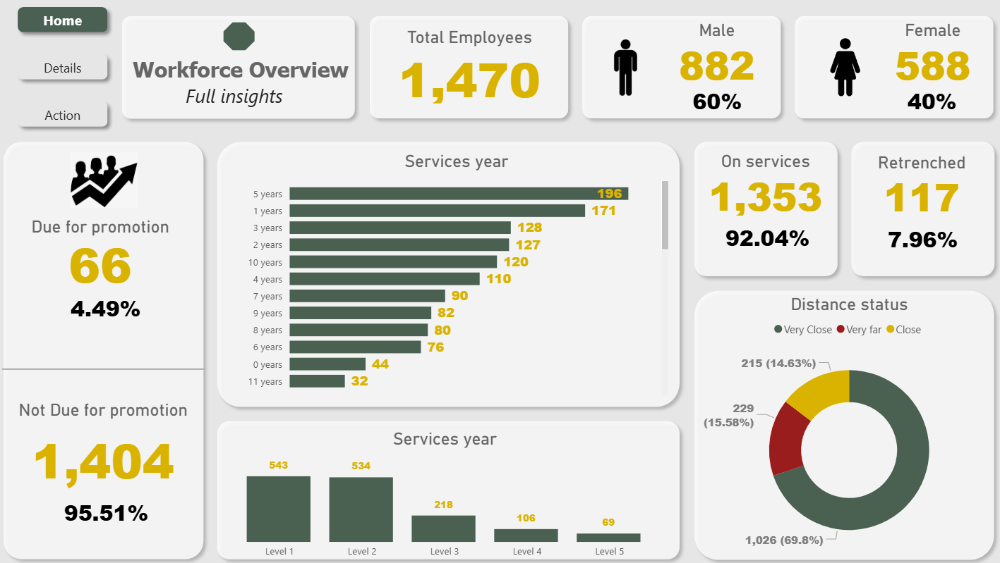
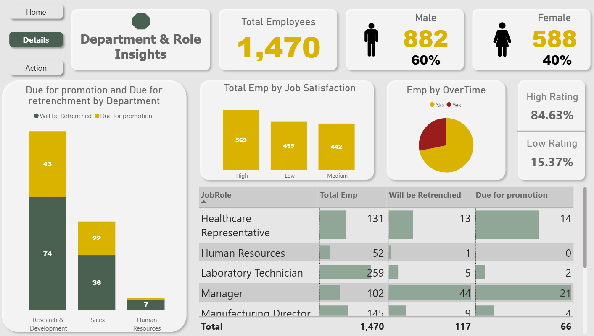
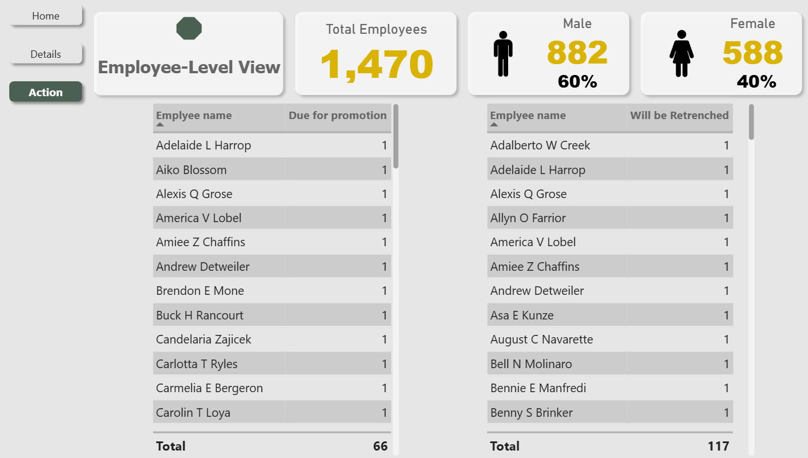

# Workforce Retention & Attrition Analysis

*A Power BI case study analyzing workforce retention, employee attrition patterns, and promotion-review indicators.*

## Project Overview

This project analyzes a workforce dataset of **1,470 employees** to understand where employee attrition is concentrated and how it differs across roles, departments, overtime status, job satisfaction, and tenure-related indicators.

Rather than treating HR flags as predictions, the analysis separates **recorded outcomes** from **rule-based review indicators**. The `Attrition` field is used as the observed employee outcome, while the promotion-review flag is transparently defined using years since last promotion.

## Business Question

**Which workforce characteristics are associated with employee attrition, and where are the strongest differences across roles and working conditions?**

Supporting questions include:
- Which job roles and departments show the highest attrition rates?
- How does attrition differ between employees with and without overtime?
- How does job satisfaction relate to observed attrition?
- Which employee records meet the defined rule for promotion review?

## Dataset

The analysis covers **1,470 employee records** with fields including:

- Attrition
- Department and Job Role
- Overtime
- Job Satisfaction
- Job Level
- Years at Company
- Years in Current Role
- Years Since Last Promotion
- Demographic and employment attributes

Employee names are linked through `EmployeeNumber` from a separate lookup table.

## Key Metrics

- **Total Employees:** 1,470
- **Attrition Records:** 237
- **Attrition Rate:** 16.1%
- **Retained Employees:** 1,233
- **Retention Rate:** 83.9%
- **Promotion Review Flag:** 66 employees

The promotion-review indicator is **rule-based**, defined as employees with **11 or more years since their last promotion**. It is a review flag, not a recommendation that an employee should be promoted.

## Key Findings

### Overtime is associated with substantially higher attrition

Employees working overtime show an attrition rate of approximately **30.5%**, compared with **10.4%** among employees without overtime.

This is a descriptive association in the dataset and should not be interpreted as evidence that overtime causes attrition.

### Attrition varies substantially by job role

The highest observed attrition rate appears among **Sales Representatives (39.8%)**, followed by **Laboratory Technicians (23.9%)** and **Human Resources roles (23.1%)**.

This role-level view is more informative than raw attrition counts because job-role populations differ in size.

### Sales shows the highest department-level attrition rate

- **Sales:** 20.6%
- **Human Resources:** 19.0%
- **Research & Development:** 13.8%

Although Research & Development contains more attrition records in absolute terms, its larger workforce results in a lower attrition rate than Sales.

### Job satisfaction shows meaningful differences

Employees with the lowest job satisfaction level show an attrition rate of approximately **22.8%**, while employees with the highest satisfaction level show approximately **11.3%**.

The relationship is not perfectly linear across all satisfaction levels, so the analysis avoids claiming a direct causal effect.

## Dashboard Structure

### 1. Workforce Overview & Attrition

Executive-level workforce KPIs and workforce structure, including:

- Total employees
- Attrition and retention metrics
- Promotion-review flag
- Employee distribution by tenure group
- Employee distribution by job level
- Gender distribution

### 2. Attrition Drivers & Workforce Segments

Focused comparison of attrition rates across:

- Job Role
- Department
- Overtime status
- Job Satisfaction

The page emphasizes **rates rather than raw counts** so that groups of different sizes can be compared more meaningfully.

### 3. Employee Review & Attrition Records

Employee-level records for two separate purposes:

- **Recorded Attrition:** employees with `Attrition = Yes`
- **Promotion Review:** employees meeting the rule `YearsSinceLastPromotion >= 11`

These tables support record review and transparency; they are not predictive models or automated HR decisions.

## Data Preparation & Modeling

The Power BI model uses employee-level HR data and an employee-name lookup linked through `EmployeeNumber`.

The project demonstrates:

- Power Query for data preparation and transformation
- Relationship-based data modeling
- DAX measures for attrition, retention, and review KPIs
- Rate-based comparison across workforce segments
- Employee-level filtering and drill-down
- Multi-page dashboard design

## Tools & Skills

**Power BI · DAX · Power Query · Data Modeling · KPI Design · Data Validation · Workforce Analytics · Data Visualization**

## Analytical Notes & Limitations

- `Attrition` is treated as a **recorded outcome**, not a prediction of future employee behavior.
- Relationships shown in the dashboard are descriptive associations and should not be interpreted as causal effects.
- The promotion-review flag is based only on **11+ years since last promotion** and does not represent a complete promotion decision framework.
- Employee-level outputs are intended for analytical review, not automated employment decisions.

## Dashboard File

**Live report:** https://app.powerbi.com/view?r=eyJrIjoiMDFiYzk4NTQtMmE2OC00NDQ2LWI5NjEtY2I2MTFiMzI2OGE5IiwidCI6ImRmODY3OWNkLWE4MGUtNDVkOC05OWFjLWM4M2VkN2ZmOTVhMCJ9

## Source & Attribution

The project originated from an HR Power BI practice dataset and tutorial structure. The analytical framing, KPI definitions, attrition-focused comparisons, validation of the promotion-review rule, and portfolio documentation were developed as an independent analytical case study.

Original tutorial reference: [Power BI HR Dashboard](https://www.youtube.com/watch?v=0BKlUySopU4&list=PLwIcJx1aSL1SeTJgPbFgf1V-5CfsV4l1l)
